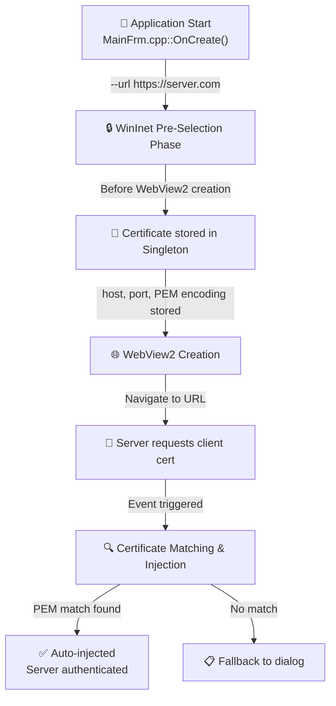
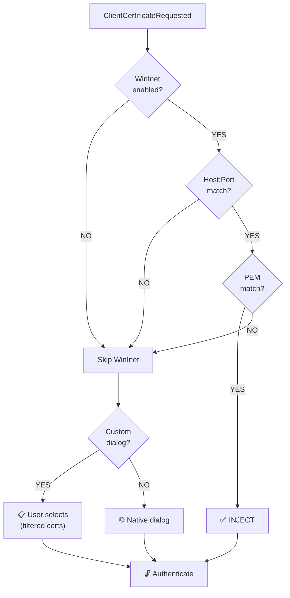

# Certificate Injection Flow: WinInet to WebView2

## Overview

This document explains the complete process of pre-selecting a client certificate using WinInet and injecting it into WebView2 when the same server requires client certificate authentication.

The implementation now includes **intelligent certificate filtering** that mimics WinInet's behavior by filtering certificates based on Enhanced Key Usage (EKU) for Client Authentication, ensuring only appropriate certificates are presented to the user.

The code has been **refactored into separate, well-documented modules** with XML documentation comments for better maintainability.

## Architecture Diagram



## Modular Architecture

The certificate injection system is organized into well-documented, cohesive modules:

### Security Module (`Security/`)

| File | Purpose | Documentation |
|------|---------|---------------|
| `WinInetHelpers.h` | RAII wrappers and shared types | ✅ XML comments |
| `ClientCertificateSelector.h/.cpp` | Certificate filtering and EKU validation | ✅ XML comments |
| `HttpsDownloader.h/.cpp` | WinInet HTTPS client with cert selection | ✅ XML comments |
| `WinInetCertPreSelector.h/.cpp` | Thread-safe singleton for cert storage | ✅ XML comments |

### Integration Points

| File | Purpose |
|------|---------|
| `MainFrm.cpp` | Triggers pre-selection before WebView2 creation |
| `WebViewEvents.h` | ClientCertificateRequested event handler |
| `Utility.h/.cpp` | PEM normalization for reliable matching |

## Phase 1: WinInet Pre-Selection (BEFORE WebView2)

- User launches: `.\WebView2.exe --url https://server.com`
- MainFrm::OnCreate() calls `WinInetCertPreSelector::Instance().Run(url)`
- `HttpsDownloader` sends HTTPS request to server
- Server asks for client certificate
- **Smart filtering applied**: `ClientCertificateSelector` filters by Client Authentication EKU
- Windows dialog appears with filtered certificates
- Selected cert info is stored in singleton:
  - `host`: "server.com"
  - `port`: 443
  - `subject`: "CN=User Name" or UPN/GUID
  - `certContext`: PCCERT_CONTEXT pointer (duplicated)
  - `pemEncoding`: Full PEM-encoded certificate for reliable matching

### Key Method: Run()

Located in `WinInetCertPreSelector.cpp`:

```cpp
/// <summary>
/// Executes an HTTPS request to the specified URL, triggering client certificate selection.
/// The selected certificate is stored internally by endpoint (host:port).
/// This should be called BEFORE creating the WebView2 control.
/// </summary>
std::string Run(const std::wstring& url, const std::wstring& certSubjectFilter = L"")
{
    SelectedCertInfo info;
    HttpsDownloader  dl;
    std::string      body = dl.Download(url, certSubjectFilter, &info);

    if (info.certContext)
    {
        std::lock_guard lock(m_mutex);

        // Store certificate for this host:port endpoint
        auto it = FindByEndpointNoLock(info.host, info.port);
        if (it != m_certInfos.end())
            *it = std::move(info);  // Update existing
        else
            m_certInfos.push_back(std::move(info));  // Add new

        m_lastSelectedIndex = m_certInfos.size() - 1;
        LOG_TRACE("WinInet cert selected and stored");
    }
    return body;
}
```

## Phase 2: WebView2 Creation & Navigation

- WebView2 is created with initialUrl parameter
- WebView2 navigates to the URL
- Connection established to HTTPS server

```cpp
std::wstring initialUrl = !m_webviewprofile.initialUrl.empty() 
    ? m_webviewprofile.initialUrl 
    : L"https://msdn.microsoft.com";

m_webview2 = std::make_unique<WebView2::Core::CWebView2>(
    browserDir, userDataDir, initialUrl
);
```

## Phase 3: Server Requests Certificate

- Server responds: "Client certificate required"
- WebView2 fires `ClientCertificateRequested` event
- Event handler in `WebViewEvents.h` is triggered

## Phase 4: Certificate Injection (THE CORE)

### Step 1: Extract Event Information

```cpp
wil::com_ptr<ICoreWebView2ClientCertificateCollection> certificateCollection;
args->get_MutuallyTrustedCertificates(&certificateCollection);

wil::unique_cotaskmem_string host;
args->get_Host(&host);  // "server.com"

INT port;
args->get_Port(&port);  // 443

UINT certificateCollectionCount;
certificateCollection->get_Count(&certificateCollectionCount);
```

### Step 2: Check Host:Port Match

```cpp
auto& preSel = webview::net::WinInetCertPreSelector::Instance();

if (preSel.IsEnabled() &&
    preSel.HasMatchFor(host.get(), static_cast<INTERNET_PORT>(port)))
{
    // Same server - proceed with injection
}
else
{
    // Different server or feature disabled - use fallback
}
```

### Step 3: PEM-Based Certificate Matching

**NEW**: Instead of subject string matching, we now use **PEM encoding comparison** for reliable matching:

```cpp
// Get the PEM encoding of the stored WinInet certificate
const std::wstring wantedPem = preSel.GetPemEncodingFor(
    host.get(), static_cast<INTERNET_PORT>(port));

// Normalize PEM using Utility class (removes headers, whitespace, newlines)
const std::wstring wantedPemNormalized = Utility::NormalizePem(wantedPem);

wil::com_ptr<ICoreWebView2ClientCertificate> matchedCert;

for (UINT i = 0; i < certificateCollectionCount; ++i)
{
    wil::com_ptr<ICoreWebView2ClientCertificate> candidate;
    certificateCollection->GetValueAtIndex(i, &candidate);

    wil::unique_cotaskmem_string candidatePem;
    if (SUCCEEDED(candidate->ToPemEncoding(&candidatePem)))
    {
        std::wstring candidatePemNormalized = Utility::NormalizePem(candidatePem.get());

        // CRITICAL: Compare normalized PEM encodings (more reliable than subject)
        if (wantedPemNormalized == candidatePemNormalized)
        {
            matchedCert = candidate;
            break;
        }
    }
}
```

**Why PEM matching?**
- Subject strings can vary in format (UPN vs CN vs GUID)
- WinInet may return `gillesg@microsoft.com` while WebView2 returns `353c7f90-524b-478a-b57d-51372c54e884`
- PEM encoding is the **actual certificate binary**, guaranteed to match exactly
- Normalization handles different line endings (CRLF vs LF) and whitespace

### Step 4: Inject Certificate

```cpp
if (matchedCert)
{
    // Tell WebView2 to use this certificate
    args->put_SelectedCertificate(matchedCert.get());

    // Mark event as handled
    args->put_Handled(TRUE);

    LOG_TRACE("WinInet pre-selected cert injected for host: " + host);
    return S_OK;
}
else
{
    // Fallback to custom dialog or native UI
}
```

## Smart Certificate Filtering

The implementation now includes **intelligent certificate filtering** similar to WinInet's native behavior, implemented in `ClientCertificateSelector.cpp`:

### Features

1. **EKU Filtering**: Only certificates with `Client Authentication` Extended Key Usage (OID `1.3.6.1.5.5.7.3.2`) are shown
2. **Subject Filtering**: Optional subject filter for programmatic selection
3. **Filtered Dialog**: Custom certificate selection dialog shows only eligible certificates

### Implementation

Located in `ClientCertificateSelector.cpp`:

```cpp
/// <summary>
/// Check if certificate has Client Authentication EKU
/// OID: 1.3.6.1.5.5.7.3.2 (szOID_PKIX_KP_CLIENT_AUTH)
/// </summary>
/// <param name="ctx">Certificate context to check</param>
/// <returns>true if the certificate has Client Authentication EKU</returns>
bool HasClientAuthEKU(PCCERT_CONTEXT ctx)
{
    DWORD usageSize = 0;
    if (!CertGetEnhancedKeyUsage(ctx, 0, nullptr, &usageSize))
        return false;

    std::vector<BYTE> usageBuffer(usageSize);
    CERT_ENHKEY_USAGE* usage = reinterpret_cast<CERT_ENHKEY_USAGE*>(usageBuffer.data());

    if (!CertGetEnhancedKeyUsage(ctx, 0, usage, &usageSize))
        return false;

    for (DWORD i = 0; i < usage->cUsageIdentifier; i++)
    {
        if (strcmp(usage->rgpszUsageIdentifier[i], szOID_PKIX_KP_CLIENT_AUTH) == 0)
            return true;
    }
    return false;
}

/// <summary>
/// Filters certificates from the current user's MY store to show only those
/// suitable for client authentication and optionally matching a subject filter.
/// </summary>
/// <param name="request">Optional WinInet request handle for CA filtering</param>
/// <param name="subjectFilter">Optional subject string to match</param>
/// <returns>Vector of certificates matching all criteria</returns>
std::vector<UniqueCertContext> SelectClientAuthCertificates(
    HINTERNET request = nullptr,
    const std::wstring& subjectFilter = L"")
{
    std::vector<UniqueCertContext> result;
    HCERTSTORE store = CertOpenSystemStoreW(0, L"MY");

    PCCERT_CONTEXT ctx = nullptr;
    while ((ctx = CertEnumCertificatesInStore(store, ctx)) != nullptr)
    {
        // Filter 1: Subject filter (if provided)
        if (!subjectFilter.empty() && !SubjectMatches(ctx, subjectFilter))
            continue;

        // Filter 2: Must have Client Authentication EKU
        if (!HasClientAuthEKU(ctx))
            continue;

        // Filter 3: Issued by acceptable CA (if server provides list)
        if (request != nullptr && !IsIssuedByAcceptableCA(ctx, request))
            continue;

        // Certificate passes all filters
        result.push_back(UniqueCertContext(CertDuplicateCertificateContext(ctx)));
    }

    CertCloseStore(store, 0);
    return result;
}
```

### Benefits

- **User Experience**: Users only see relevant certificates, reducing confusion
- **Security**: Only certificates suitable for client authentication are selectable
- **Consistency**: Behavior matches WinInet's native certificate selection
- **Fewer Errors**: Prevents selection of inappropriate certificates (signing-only, encryption-only, etc.)
- **CA Filtering**: Optionally filters by server's acceptable CA list (future enhancement)

## Decision Flow



## Complete Sequence

1. **User launches** `WebView2.exe --url https://server.com`
2. **MainFrm::OnCreate()** 
   - Calls `WinInetCertPreSelector::Run(url)` BEFORE creating WebView2
   - **Smart filtering applied**: Only Client Auth EKU certificates shown
   - Windows cert dialog appears with filtered list
   - User selects certificate
   - Cert stored in singleton with PEM encoding
3. **WebView2 created & navigates** to the URL
4. **Server requests cert**
   - WebView2 fires ClientCertificateRequested event
5. **Event handler checks**:
   - Is WinInet feature enabled? ✓
   - Is this the same host:port? ✓
   - Does the PEM encoding match? ✓
6. **Certificate is injected**
   - `args->put_SelectedCertificate(cert)`
   - `args->put_Handled(TRUE)`
7. **Server authenticates** with the certificate

## Common Issues

### Issue: Certificate Not Injected

**Symptoms**: Dialog still appears even though cert was pre-selected

**Causes**:
1. **PEM mismatch**: Different certificate selected (very rare with PEM matching)
2. **Feature disabled**: `WinInet Pre-Select Certificate` not enabled in menu
3. **Different host:port**: Connecting to different server than pre-selected
4. **No cert stored**: User cancelled dialog or --url not provided

**Debug**: Check logs for:
```
"HasMatchFor: host=... port=... match=false"
"ClientCertRequested: comparing PEM cert in N certs"
"WantedPem length=2772, normalized length=2000"
"cert[5] subject=Gilles Guimard, PEM length=2728, normalized=2000"
"--> PEM MATCH FOUND at index 5"
"WinInet cert PEM not found in WebView2 collection"
```

### Issue: No Certificates Shown in Dialog

**Symptoms**: Certificate selection dialog is empty or shows very few certificates

**Cause**: Smart filtering is working correctly - you have no/few certificates with Client Authentication EKU

**Fix**:
- Verify certificates have Client Authentication EKU
- Check certificate store: `certmgr.msc` → Personal → Certificates
- Right-click certificate → Properties → Enhanced Key Usage
- Should include "Client Authentication (1.3.6.1.5.5.7.3.2)"

### Issue: Feature Not Working

**Fix**:
1. Launch with `--url https://server.com`
2. Enable "Scenario → WinInet Pre-Select Certificate" menu
3. Verify logs show cert was selected in WinInet
4. Check that PEM encodings match (normalized lengths should be equal)

## API Summary

### Singleton Management

#### `WinInetCertPreSelector::Instance()`
- **Purpose**: Access the thread-safe singleton instance
- **Returns**: Reference to the global `WinInetCertPreSelector`
- **Thread-Safety**: Magic static initialization (C++11+)

#### `SetEnabled(bool enabled)` / `IsEnabled()`
- **Purpose**: Enable or disable the certificate pre-selection feature
- **Thread-Safety**: Uses `std::atomic<bool>` for lock-free access
- **Default**: Enabled

### Certificate Selection & Storage

#### `Run(url, certSubjectFilter)`
- **Purpose**: Execute WinInet pre-selection before WebView2 creation
- **Parameters**:
  - `url`: Target HTTPS URL (e.g., `L"https://server.com"`)
  - `certSubjectFilter`: Optional subject filter (empty = show dialog)
- **Returns**: HTTP response body (may be ignored)
- **Throws**: `WinInetException` or `std::runtime_error` on failure
- **Side Effect**: Stores selected certificate by endpoint

#### `HasMatchFor(host, port)`
- **Purpose**: Check if a certificate was pre-selected for this endpoint
- **Parameters**:
  - `host`: Hostname string (e.g., `L"server.com"`)
  - `port`: TCP port number (e.g., `443`)
- **Returns**: `true` if matching certificate exists and feature is enabled
- **Thread-Safety**: Read-only operation with mutex protection

#### `GetPemEncodingFor(host, port)`
- **Purpose**: Retrieve PEM encoding of stored certificate for endpoint
- **Returns**: Base64-encoded DER certificate with headers
- **Throws**: `std::runtime_error` if no certificate for endpoint
- **Usage**: Used by WebView2 for certificate matching

### Certificate Filtering (ClientCertificateSelector)

#### `HasClientAuthEKU(ctx)`
- **Purpose**: Check if certificate has Client Authentication EKU
- **Parameter**: `PCCERT_CONTEXT ctx` - Certificate context to check
- **Returns**: `true` if OID `1.3.6.1.5.5.7.3.2` is present
- **Usage**: Called during certificate enumeration to filter eligible certificates

#### `SelectClientAuthCertificates(request, filter)`
- **Purpose**: Get filtered list of certificates suitable for client authentication
- **Parameters**:
  - `request`: Optional WinInet request handle (for CA filtering, future)
  - `filter`: Optional subject string to match
- **Returns**: `std::vector<UniqueCertContext>` of eligible certificates
- **Filters Applied**:
  1. Subject filter (if provided)
  2. Client Authentication EKU required
  3. Acceptable CA list (if request handle provided)

#### `GetSubjectName(ctx)` / `GetIssuerName(ctx)`
- **Purpose**: Extract formatted subject/issuer names from certificate
- **Returns**: Wide string with formatted name (e.g., `L"CN=User Name"`)
- **Fallback**: Returns hex-encoded subject if name extraction fails

#### `GetPemEncoding(ctx)`
- **Purpose**: Convert certificate context to PEM encoding
- **Returns**: Wide string with Base64-encoded DER and headers
- **Format**: 
  ```
  -----BEGIN CERTIFICATE-----
  <Base64 data>
  -----END CERTIFICATE-----
  ```

### WebView2 Integration

#### `put_SelectedCertificate(certificate)`
- **Purpose**: Tell WebView2 which certificate to use
- **Input**: `ICoreWebView2ClientCertificate* certificate`
- **Effect**: WebView2 will send this certificate to the server
- **Required**: Must call `put_Handled(TRUE)` to suppress native dialog

#### `put_Handled(value)`
- **Purpose**: Mark ClientCertificateRequested event as handled
- **Input**: `BOOL value` (`TRUE` to handle, `FALSE` for native dialog)
- **Effect**: Prevents native certificate dialog when `TRUE`

### Utility Functions

#### `Utility::NormalizePem(pem)`
- **Purpose**: Normalize PEM encoding for reliable certificate comparison
- **Input**: PEM-encoded certificate string with headers and whitespace
- **Returns**: Base64-only string (headers, newlines, and whitespace removed)
- **Location**: `WebView2/Utilities/Utility.h` and `Utility.cpp`
- **Usage**: Both WinInet pre-selection and WebView2 injection use this
- **Example**:
  ```cpp
  // Input:  "-----BEGIN CERTIFICATE-----\nMIIC...\n-----END CERTIFICATE-----"
  // Output: "MIIC..."
  ```

## Key Files

### Security Module (`WebView2WTL.Sample/WebView2/Security/`)

| File | Purpose | Lines | Status |
|------|---------|-------|--------|
| `WinInetHelpers.h` | RAII wrappers (`UniqueCertContext`, `UniqueInternetHandle`), `SelectedCertInfo` structure | ~80 | ✅ XML documented |
| `ClientCertificateSelector.h` | Certificate filtering interface (EKU validation, subject/issuer extraction, PEM encoding) | ~60 | ✅ XML documented |
| `ClientCertificateSelector.cpp` | Implementation of certificate store enumeration and filtering | ~200 | ✅ Well-commented |
| `HttpsDownloader.h` | WinInet HTTPS client with certificate selection interface | ~120 | ✅ XML documented |
| `HttpsDownloader.cpp` | WinInet request flow, retry logic, certificate attachment | ~250 | ✅ Well-commented |
| `WinInetCertPreSelector.h` | Thread-safe singleton, endpoint-based certificate storage | ~130 | ✅ XML documented |
| `WinInetCertPreSelector.cpp` | Singleton implementation, thread-safe accessors | ~150 | ✅ Well-commented |

### Integration Points

| File | Purpose | Key Functions |
|------|---------|---------------|
| `UI/MainFrm.cpp` | Triggers WinInet pre-selection before WebView2 creation | `OnCreate()` calls `WinInetCertPreSelector::Run()` |
| `Utilities/WebViewEvents.h` | WebView2 ClientCertificateRequested event handler | `enable_client_certificate_request_event()` |
| `Utilities/Utility.h/.cpp` | PEM normalization utility for certificate matching | `Utility::NormalizePem()` |

### Documentation

| File | Purpose |
|------|---------|
| `CERTIFICATE_INJECTION.md` | Complete architecture and flow documentation (this file) |
| `SECURITY_AUDIT_REPORT.md` | Security audit results and verification |
| `PRECOMPILED_HEADERS_OPTIMIZATION.md` | Header optimization documentation |

## Thread Safety

- Singleton uses `std::mutex` to protect `m_certInfos` collection
- All access to stored certificates is thread-safe
- Can be called from multiple threads safely
- PEM encoding is computed once and cached

## Performance Considerations

- PEM encoding is generated once during certificate selection
- Normalization is lightweight (O(n) string processing)
- Smart filtering reduces dialog complexity
- Collection-based storage supports multiple endpoints efficiently

## References

- WebView2 ClientCertificateRequested: https://learn.microsoft.com/en-us/microsoft-edge/webview2/reference/win32/icorewebview2_5
- WinInet: https://learn.microsoft.com/en-us/windows/win32/api/wininet/
- RFC 8446 TLS 1.3: https://tools.ietf.org/html/rfc8446
- RFC 7468 PEM Format: https://tools.ietf.org/html/rfc7468
- Client Authentication EKU: https://oidref.com/1.3.6.1.5.5.7.3.2
