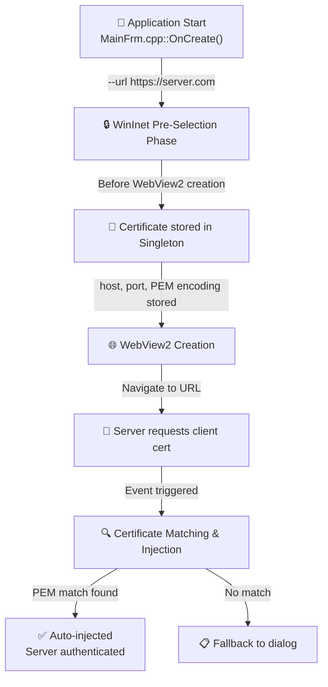
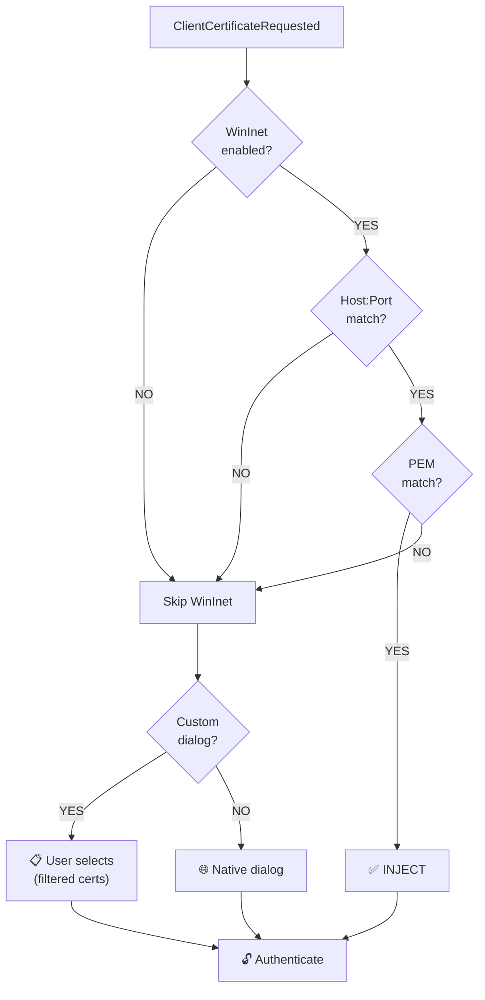

# Certificate Injection Flow: WinInet to WebView2

## Overview

This document explains the complete process of pre-selecting a client certificate using WinInet and injecting it into WebView2 when the same server requires client certificate authentication.

The implementation now includes **intelligent certificate filtering** that mimics WinInet's behavior by filtering certificates based on Enhanced Key Usage (EKU) for Client Authentication, ensuring only appropriate certificates are presented to the user.

## Architecture Diagram



## Phase 1: WinInet Pre-Selection (BEFORE WebView2)

- User launches: `.\WebView2.exe --url https://server.com`
- MainFrm::OnCreate() calls `WinInetCertPreSelector::Instance().Run(url)`
- WinInet sends HTTPS request to server
- Server asks for client certificate
- **Smart filtering applied**: Only certificates with Client Authentication EKU are shown
- Windows dialog appears with filtered certificates
- Selected cert info is stored in singleton:
  - `host`: "server.com"
  - `port`: 443
  - `subject`: "CN=User Name" or UPN/GUID
  - `certContext`: PCCERT_CONTEXT pointer (duplicated)
  - `pemEncoding`: Full PEM-encoded certificate for reliable matching

### Key Method: Run()

```cpp
std::string Run(const std::wstring& url, const std::wstring& certSubjectFilter = L"")
{
    SelectedCertInfo info;
    HttpsDownloader  dl;
    std::string      body = dl.Download(url, certSubjectFilter, &info);

    if (info.certContext)
    {
        std::lock_guard lock(m_mutex);

        // Store certificate for this host:port endpoint
        const std::string key = MakeKey(info.host, info.port);
        auto it = FindByKeyNoLock(key);
        if (it != m_certInfos.end())
            *it = std::move(info);  // Update existing
        else
            m_certInfos.push_back(std::move(info));  // Add new

        LOG_TRACE("WinInet cert selected and stored");
    }
    return body;
}
```

## Phase 2: WebView2 Creation & Navigation

- WebView2 is created with initialUrl parameter
- WebView2 navigates to the URL
- Connection established to HTTPS server

```cpp
std::wstring initialUrl = !m_webviewprofile.initialUrl.empty() 
    ? m_webviewprofile.initialUrl 
    : L"https://msdn.microsoft.com";

m_webview2 = std::make_unique<WebView2::Core::CWebView2>(
    browserDir, userDataDir, initialUrl
);
```

## Phase 3: Server Requests Certificate

- Server responds: "Client certificate required"
- WebView2 fires `ClientCertificateRequested` event
- Event handler in WebViewEvents.h is triggered

## Phase 4: Certificate Injection (THE CORE)

### Step 1: Extract Event Information

```cpp
wil::com_ptr<ICoreWebView2ClientCertificateCollection> certificateCollection;
args->get_MutuallyTrustedCertificates(&certificateCollection);

wil::unique_cotaskmem_string host;
args->get_Host(&host);  // "server.com"

INT port;
args->get_Port(&port);  // 443

UINT certificateCollectionCount;
certificateCollection->get_Count(&certificateCollectionCount);
```

### Step 2: Check Host:Port Match

```cpp
auto& preSel = webview::net::WinInetCertPreSelector::Instance();

if (preSel.IsEnabled() &&
    preSel.HasMatchFor(host.get(), static_cast<INTERNET_PORT>(port)))
{
    // Same server - proceed with injection
}
else
{
    // Different server or feature disabled - use fallback
}
```

### Step 3: PEM-Based Certificate Matching

**NEW**: Instead of subject string matching, we now use **PEM encoding comparison** for reliable matching:

```cpp
// Get the PEM encoding of the stored WinInet certificate
const std::wstring wantedPem = preSel.GetPemEncodingFor(
    host.get(), static_cast<INTERNET_PORT>(port));

// Normalize PEM (remove headers, whitespace, newlines)
auto NormalizePem = [](const std::wstring& pem) -> std::wstring
{
    std::wstring normalized;
    bool skipLine = false;
    for (wchar_t c : pem)
    {
        if (c == L'-') { skipLine = true; continue; }
        if (c == L'\n') { skipLine = false; continue; }
        if (skipLine) continue;
        if ((c >= L'A' && c <= L'Z') || (c >= L'a' && c <= L'z') || 
            (c >= L'0' && c <= L'9') || c == L'+' || c == L'/' || c == L'=')
        {
            normalized += c;
        }
    }
    return normalized;
};

const std::wstring wantedPemNormalized = NormalizePem(wantedPem);

wil::com_ptr<ICoreWebView2ClientCertificate> matchedCert;

for (UINT i = 0; i < certificateCollectionCount; ++i)
{
    wil::com_ptr<ICoreWebView2ClientCertificate> candidate;
    certificateCollection->GetValueAtIndex(i, &candidate);

    wil::unique_cotaskmem_string candidatePem;
    if (SUCCEEDED(candidate->ToPemEncoding(&candidatePem)))
    {
        std::wstring candidatePemNormalized = NormalizePem(candidatePem.get());

        // CRITICAL: Compare normalized PEM encodings (more reliable than subject)
        if (wantedPemNormalized == candidatePemNormalized)
        {
            matchedCert = candidate;
            break;
        }
    }
}
```

**Why PEM matching?**
- Subject strings can vary in format (UPN vs CN vs GUID)
- WinInet may return `gillesg@microsoft.com` while WebView2 returns `353c7f90-524b-478a-b57d-51372c54e884`
- PEM encoding is the **actual certificate binary**, guaranteed to match exactly
- Normalization handles different line endings (CRLF vs LF) and whitespace

### Step 4: Inject Certificate

```cpp
if (matchedCert)
{
    // Tell WebView2 to use this certificate
    args->put_SelectedCertificate(matchedCert.get());

    // Mark event as handled
    args->put_Handled(TRUE);

    LOG_TRACE("WinInet pre-selected cert injected for host: " + host);
    return S_OK;
}
else
{
    // Fallback to custom dialog or native UI
}
```

## Smart Certificate Filtering

The implementation now includes **intelligent certificate filtering** similar to WinInet's native behavior:

### Features

1. **EKU Filtering**: Only certificates with `Client Authentication` Extended Key Usage (OID `1.3.6.1.5.5.7.3.2`) are shown
2. **Subject Filtering**: Optional subject filter for programmatic selection
3. **Filtered Dialog**: Custom certificate selection dialog shows only eligible certificates

### Implementation

```cpp
/// Check if certificate has Client Authentication EKU
static bool HasClientAuthEKU(PCCERT_CONTEXT ctx)
{
    DWORD usageSize = 0;
    if (!CertGetEnhancedKeyUsage(ctx, 0, nullptr, &usageSize))
        return false;

    std::vector<BYTE> usageBuffer(usageSize);
    CERT_ENHKEY_USAGE* usage = reinterpret_cast<CERT_ENHKEY_USAGE*>(usageBuffer.data());

    if (!CertGetEnhancedKeyUsage(ctx, 0, usage, &usageSize))
        return false;

    for (DWORD i = 0; i < usage->cUsageIdentifier; i++)
    {
        if (strcmp(usage->rgpszUsageIdentifier[i], szOID_PKIX_KP_CLIENT_AUTH) == 0)
            return true;
    }
    return false;
}

/// Select certificates with smart filtering
static std::vector<UniqueCertContext> SelectClientAuthCertificates(
    HINTERNET request = nullptr,
    const std::wstring& subjectFilter = L"")
{
    std::vector<UniqueCertContext> result;
    HCERTSTORE store = CertOpenSystemStoreW(0, L"MY");

    PCCERT_CONTEXT ctx = nullptr;
    while ((ctx = CertEnumCertificatesInStore(store, ctx)) != nullptr)
    {
        // Filter 1: Subject filter (if provided)
        if (!subjectFilter.empty() && !SubjectMatches(ctx, subjectFilter))
            continue;

        // Filter 2: Must have Client Authentication EKU
        if (!HasClientAuthEKU(ctx))
            continue;

        // Certificate passes all filters
        result.push_back(DuplicateCert(ctx));
    }

    return result;
}
```

### Benefits

- **User Experience**: Users only see relevant certificates, reducing confusion
- **Security**: Only certificates suitable for client authentication are selectable
- **Consistency**: Behavior matches WinInet's native certificate selection
- **Fewer Errors**: Prevents selection of inappropriate certificates (signing-only, encryption-only, etc.)

## Decision Flow



## Complete Sequence

1. **User launches** `WebView2.exe --url https://server.com`
2. **MainFrm::OnCreate()** 
   - Calls `WinInetCertPreSelector::Run(url)` BEFORE creating WebView2
   - **Smart filtering applied**: Only Client Auth EKU certificates shown
   - Windows cert dialog appears with filtered list
   - User selects certificate
   - Cert stored in singleton with PEM encoding
3. **WebView2 created & navigates** to the URL
4. **Server requests cert**
   - WebView2 fires ClientCertificateRequested event
5. **Event handler checks**:
   - Is WinInet feature enabled? ✓
   - Is this the same host:port? ✓
   - Does the PEM encoding match? ✓
6. **Certificate is injected**
   - `args->put_SelectedCertificate(cert)`
   - `args->put_Handled(TRUE)`
7. **Server authenticates** with the certificate

## Common Issues

### Issue: Certificate Not Injected

**Symptoms**: Dialog still appears even though cert was pre-selected

**Causes**:
1. **PEM mismatch**: Different certificate selected (very rare with PEM matching)
2. **Feature disabled**: `WinInet Pre-Select Certificate` not enabled in menu
3. **Different host:port**: Connecting to different server than pre-selected
4. **No cert stored**: User cancelled dialog or --url not provided

**Debug**: Check logs for:
```
"HasMatchFor: host=... port=... match=false"
"ClientCertRequested: comparing PEM cert in N certs"
"WantedPem length=2772, normalized length=2000"
"cert[5] subject=Gilles Guimard, PEM length=2728, normalized=2000"
"--> PEM MATCH FOUND at index 5"
"WinInet cert PEM not found in WebView2 collection"
```

### Issue: No Certificates Shown in Dialog

**Symptoms**: Certificate selection dialog is empty or shows very few certificates

**Cause**: Smart filtering is working correctly - you have no/few certificates with Client Authentication EKU

**Fix**:
- Verify certificates have Client Authentication EKU
- Check certificate store: `certmgr.msc` → Personal → Certificates
- Right-click certificate → Properties → Enhanced Key Usage
- Should include "Client Authentication (1.3.6.1.5.5.7.3.2)"

### Issue: Feature Not Working

**Fix**:
1. Launch with `--url https://server.com`
2. Enable "Scenario → WinInet Pre-Select Certificate" menu
3. Verify logs show cert was selected in WinInet
4. Check that PEM encodings match (normalized lengths should be equal)

## API Summary

### put_SelectedCertificate()
- **Purpose**: Tell WebView2 which certificate to use
- **Input**: `ICoreWebView2ClientCertificate* certificate`
- **Effect**: WebView2 will send this cert to server

### put_Handled()
- **Purpose**: Mark event as handled by application
- **Input**: `BOOL value` (TRUE to handle, FALSE to show native dialog)
- **Effect**: Prevents native dialog if set to TRUE

### HasMatchFor(host, port)
- **Purpose**: Check if stored cert matches this server
- **Returns**: true if same host:port, false otherwise

### GetPemEncodingFor(host, port)
- **Purpose**: Get PEM encoding of stored certificate for endpoint
- **Returns**: Base64-encoded DER certificate with headers

### HasClientAuthEKU(ctx)
- **Purpose**: Check if certificate has Client Authentication EKU
- **Returns**: true if certificate is suitable for client authentication

### SelectClientAuthCertificates(request, filter)
- **Purpose**: Get filtered list of certificates suitable for client auth
- **Parameters**: 
  - `request`: WinInet request handle (for server CA list, future)
  - `filter`: Optional subject filter
- **Returns**: Vector of certificates with Client Auth EKU

## Key Files

- `WinInetCertPreSelector.h`: Pre-selection singleton, WinInet logic, smart filtering
- `WebViewEvents.h`: ClientCertificateRequested event handler with PEM-based injection
- `MainFrm.cpp`: Calls Run() before WebView2 creation
- `WebViewProfile.cpp`: Parses --url command-line argument

## Thread Safety

- Singleton uses `std::mutex` to protect `m_certInfos` collection
- All access to stored certificates is thread-safe
- Can be called from multiple threads safely
- PEM encoding is computed once and cached

## Performance Considerations

- PEM encoding is generated once during certificate selection
- Normalization is lightweight (O(n) string processing)
- Smart filtering reduces dialog complexity
- Collection-based storage supports multiple endpoints efficiently

## References

- WebView2 ClientCertificateRequested: https://learn.microsoft.com/en-us/microsoft-edge/webview2/reference/win32/icorewebview2_5
- WinInet: https://learn.microsoft.com/en-us/windows/win32/api/wininet/
- RFC 8446 TLS 1.3: https://tools.ietf.org/html/rfc8446
- RFC 7468 PEM Format: https://tools.ietf.org/html/rfc7468
- Client Authentication EKU: https://oidref.com/1.3.6.1.5.5.7.3.2
